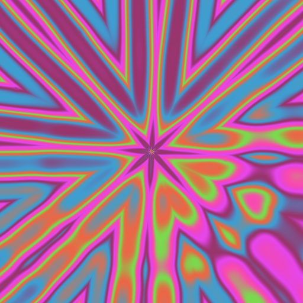
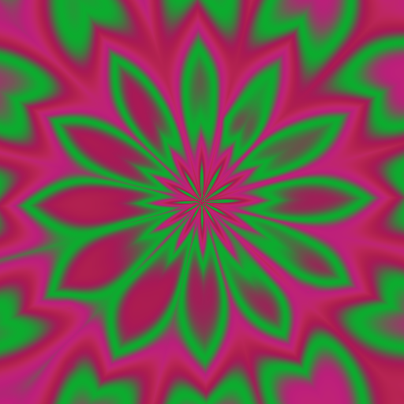
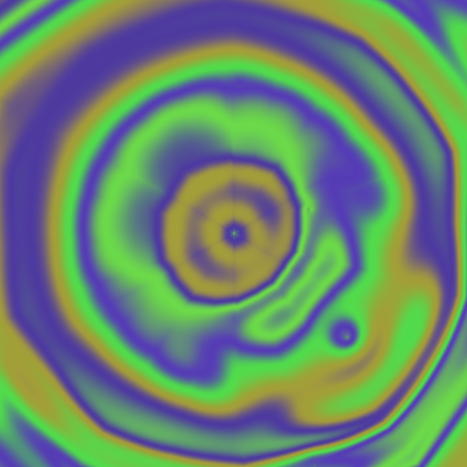
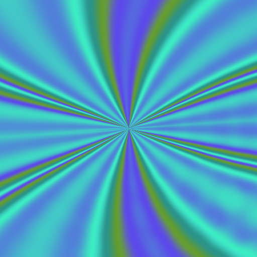

# Psychedelic

A macOS screen saver. Each pattern is a randomly generated math expression
rendered per pixel through a color ramp. Its constants drift, so the pattern
changes continuously, and every minute or so it crossfades into a mutated or
crossbred successor.

| | |
| --- | --- |
|  |  |
|  |  |

Seeds 8201, 8205, 7102 and 7104. Reproduce any of them with
`cargo run --release --bin gpu-stills -- 8201 1 512 /tmp`.

The engine is Rust. The bundle macOS loads is a Swift `ScreenSaverView` that
owns a `CAMetalLayer` and calls the Rust core through a C API.

## How a pattern is built

A genome holds two or three layers, stacked by depth.

* Each **layer** is an expression tree over `x`, `y`, `radius`, `theta` and
  `time`, built from sine, cosine, negation, sums, products and length. Every
  node kind is smooth: a crease or a jump anywhere in a tree draws a line
  across the screen, which is why `abs`, `min`, `max` and `atan2` are not in
  the set.
* Twenty four **parameter slots** feed the trees. Low slots are spatial
  frequencies, middle slots are constants, high slots are phases. Each slot
  oscillates around its own base value at its own rate.
* Coordinates are **folded** into one mirrored wedge of an n-fold symmetric
  plane, which gives the mandala forms. Each layer has its own symmetry, spin
  and detail scale.
* Layers above the base show through a **mask**, a slow wave that opens and
  closes across the screen and drifts as it goes. Each also shifts its own
  position along the palette, so the layers stay distinct instead of blending
  into one image.
* Four **movers** travel across the screen, bouncing off the edges or wrapping
  to the opposite side. They are the sources of the water rings, and layer
  terms measured from them travel with them. Anything measured from a mover
  fades out before the distance where a wrapping mover's nearest copy changes,
  so that change never shows as an edge.
* A scene holds **two 256 entry palettes** and crosses between them, on top of
  the rotation running through each ramp. The palette scale swings as well,
  stretching and compressing the color banding.

Rates are set so structure moves about 3.5% of its range per second, while
parameter amplitudes stay large, so a pattern is unrecognizable a minute later
without looking jittery. The clock inside the expressions runs at a thirtieth
of real time, since a frequency parameter multiplies whatever it is given.

Generated genomes are checked before they are shown and redrawn if they fail:
too flat, too fine for the screen to resolve, too striped, or too featureless.
Each layer is checked on its own as well as in the stack.

Each genome compiles to its own Metal fragment shader, since a fixed shader
cannot express an arbitrary tree and a CPU loop cannot fill a 5K display at
60fps. Compilation happens when a successor is bred, off the frame path. The
CPU evaluator in [src/eval.rs](src/eval.rs) renders the same field for tests
and stills, and a test asserts the two paths agree.

## Build and install

```
./build-saver.sh
```

Builds the Rust static library, compiles the Swift shell, links the bundle at
`build/Psychedelic.saver` and signs it ad hoc.

```
cp -R build/Psychedelic.saver ~/Library/Screen\ Savers/
```

Then pick Psychedelic in System Settings, Screen Saver. Its Options sheet has
drift speed, seconds per pattern, and mutation strength.

## Preview

```
cargo run --release --features preview --bin preview
```

Space breeds the next pattern, F toggles fullscreen, Escape quits. Pass a seed
as the first argument to reproduce a run.

## Stills

```
cargo run --release --bin stills -- <seed> <count> <size> <directory>
cargo run --release --bin gpu-stills -- <seed> <count> <size> <directory>
```

`stills` uses the CPU evaluator, `gpu-stills` the generated shaders. One frame
per seed by default; add a seconds-between-frames argument to sample one
pattern over time instead:

```
cargo run --release --bin gpu-stills -- 21 4 320 /tmp/frames 3.0
```

`cargo run --release --bin shader -- <seed>` prints the generated Metal.

## Tests

```
cargo test --release
./check-saver.sh
```

`check-saver.sh` loads the built bundle the way System Settings does, drives it
for a few frames and checks the renderer received them. Run `./build-saver.sh`
first.

[tests/pace.rs](tests/pace.rs) measures how far the structure moves in a second
and fails if the picture shakes or freezes. Color is excluded, since a palette
crossing changes every pixel without anything moving.
`cargo run --release --example breakdown` reports which source of motion
dominates a pattern.
